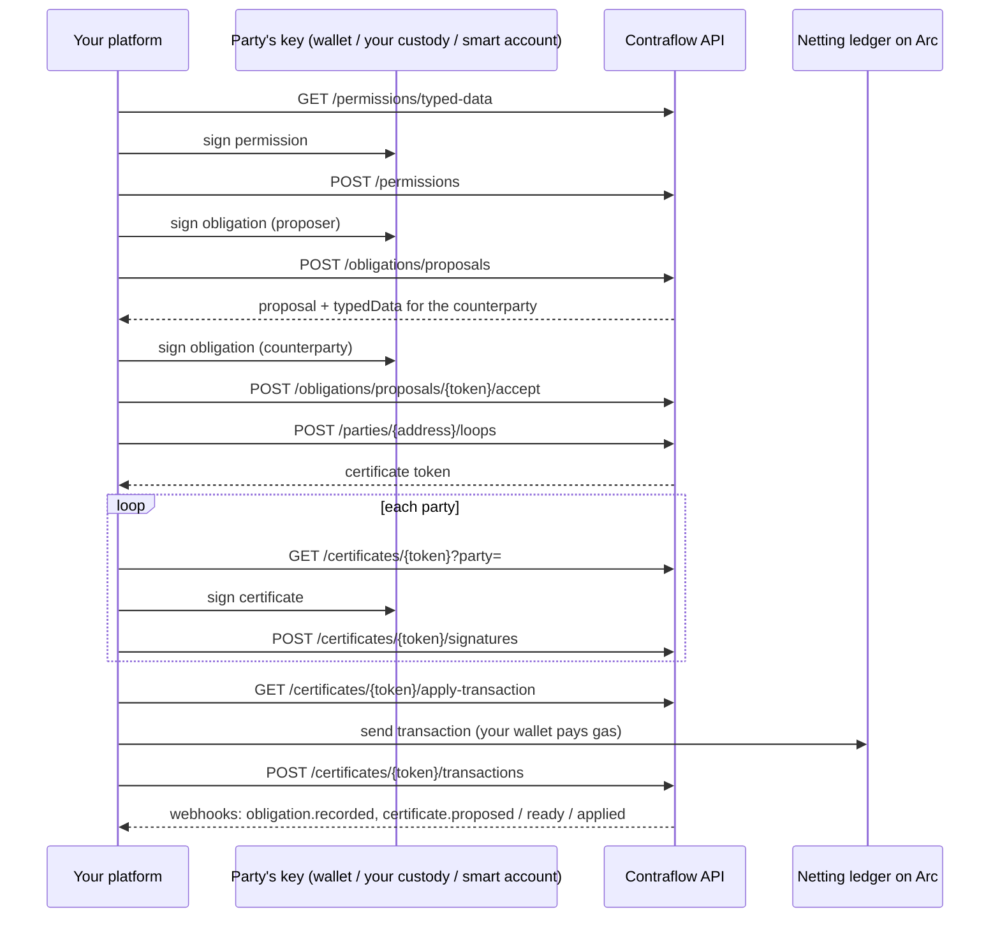

# API reference

The machine contract is the OpenAPI 3.1 document the app serves at `/api/v1/openapi.json`. This page explains how to use it. For the overview, see [API](../api.md).

* **Base path:** `/api/v1`
* **Format:** JSON in, JSON out. List and summary amounts are `amountMinor` (a minor-unit integer string) and `amountDisplay` (major units). Timestamps on those responses are unix-second strings. `chainId` is a JSON number on the tenant, an apply transaction, a webhook event, and a proposal's domain. Scopes are a small integer. Signed documents, EIP-712 fields, and certificate files keep their own names, and the integers in those payloads stay decimal strings. In EIP-712 typed-data responses, `domain.chainId` is a JSON number.
* **Amounts:** a list response's `amountMinor` of `"10000"` and `amountDisplay` of `"100.00"` are the same 100.00 USD. The signed obligation's `amount` stays the minor-unit integer string. The human-readable document's `amount` stays major units.
* **Scope:** offchain obligations only. There is no invoice or settlement API.



## Authentication

Send your key as a bearer token:

```
Authorization: Bearer cfk_test_…
```

* **Test and live keys.** Keys starting `cfk_test_` work against Arc testnet. `cfk_live_` keys work against Arc mainnet once Contraflow is deployed there; until then they get `403 live_unavailable`. The network always comes from the key, never from the request.
* **Issuing keys.** Sign in and create a test key at `/app/api-keys`. Contraflow stores only a hash of each key; the secret is shown once. You can hold two active keys at a time, so you can rotate without downtime. Live keys are still issued by request.
* **Failures.** A missing, malformed, unknown or revoked key gets `401 unauthorized`, with `WWW-Authenticate: Bearer realm="Contraflow API"`. The scheme is case-insensitive (`Bearer` or `bearer`).
* **Request id.** Send `X-Request-Id` (1–128 visible ASCII characters) and the same value comes back on every response. If you omit it, Contraflow generates one.
* **CORS.** Browser clients may call the API from any origin. Allowed headers: `Authorization`, `Content-Type`, `Idempotency-Key`, `X-Request-Id`. Wrong methods return JSON `405 method_not_allowed` with `Allow`.
* **Index.** `GET /api/v1` lists the endpoints. `GET /api/v1/openapi.json` is the OpenAPI 3.1 document.

## Acting for a party

Every endpoint except the permission ones, `GET /tenant` and `POST /webhooks/test` act for one party, named in the body (`party`), the query (`?party=`) or the path (`/parties/{address}`). You need that party's live permission with the right scope:

| Scope               | Bit | Lets you                                                                                                         |
| ------------------- | --- | ---------------------------------------------------------------------------------------------------------------- |
| `read`              | 1   | See the party's proposals, obligations and certificates; get the apply transaction; export; report a transaction |
| `propose`           | 2   | Propose obligations as the party, withdraw its proposals, search for loops that include it                       |
| `deliverSignatures` | 4   | Submit signatures the party made: accepting a proposal, signing a certificate                                    |

**No scope lets you sign for the party.** Every obligation and certificate is checked against the party's own signature.

If you don't hold the permission, the answer is `404 not_found`, the same as for a proposal or certificate that doesn't exist or doesn't involve the party. The API never confirms what you can't see.

## Idempotency

Send `Idempotency-Key: <1–255 characters>` on every `POST`:

| Situation                                         | Response                                                                                                                                                                                                                                                             |
| ------------------------------------------------- | -------------------------------------------------------------------------------------------------------------------------------------------------------------------------------------------------------------------------------------------------------------------- |
| First request with the key                        | Runs normally; the response (including a 4xx) is stored                                                                                                                                                                                                              |
| Same key, same method, path and body              | The stored response, unchanged                                                                                                                                                                                                                                       |
| Same key, different request                       | `409 idempotency_conflict`                                                                                                                                                                                                                                           |
| Same key while the first request is still pending | If the effect already exists (the proposal by document hash, the accepted obligation, the stored signature, or the reported apply transaction), that result is returned and stored. Otherwise `409 idempotency_in_progress`. This lookup never re-runs the mutation. |
| The first request failed with a 5xx               | The key stays reserved. Retry with the same key. If the effect landed, you get that result; otherwise `409 idempotency_in_progress`. Do not mint a new key.                                                                                                          |

## Rate limits

Each tenant has a budget of 600 requests a minute (`RateLimit-Limit`, `RateLimit-Remaining`, `RateLimit-Reset` on every authenticated response; `Retry-After` on 429). Obligation and certificate writes also have a per-party budget, keyed separately for the web app and for each tenant, so your API traffic doesn't share a party's browser budget. Past either, you get `429 rate_limited`. If Contraflow's rate limiter itself is unreachable, requests get `503 unavailable` rather than going through unmetered.

## Errors

Every error has the same shape:

```json
{ "error": { "code": "not_found", "message": "Not found." } }
```

| Status | Codes                                                                              | When                                                                                         |
| ------ | ---------------------------------------------------------------------------------- | -------------------------------------------------------------------------------------------- |
| 400    | `invalid_json`, `invalid_idempotency_key`                                          | Unparseable body; bad `Idempotency-Key`                                                      |
| 401    | `unauthorized`                                                                     | Missing or invalid key                                                                       |
| 403    | `live_unavailable`, `chain_unavailable`                                            | Live key before mainnet; a network without the ledger                                        |
| 404    | `not_found`                                                                        | No permission, not a party, or doesn't exist                                                 |
| 405    | `method_not_allowed`                                                               | Wrong HTTP method; see `Allow`                                                               |
| 409    | `duplicate_nonce`, `idempotency_conflict`, `idempotency_in_progress`, `not_ready`  | See each endpoint                                                                            |
| 422    | `invalid_permission`, `invalid_party`, `invalid_request`, `rejected`, `no_webhook` | The request was understood and refused. `message` says why, for example "Invalid signature." |
| 429    | `rate_limited`                                                                     | Slow down                                                                                    |
| 500    | `internal_error`                                                                   | Retry with the same `Idempotency-Key`                                                        |
| 503    | `unavailable`                                                                      | Retry later                                                                                  |

## Tenant

### GET `/tenant`

**200:** `{ "tenantId", "name", "status", "mode", "chainId", "webhookConfigured" }`. `chainId` is a JSON number. No party permission required.

### GET `/usage`

Your own usage: daily counts of this tenant's calls, the last use of each key, and per-party permission and webhook state. No party permission required.

| Query    | Constraint                                                  |
| -------- | ----------------------------------------------------------- |
| `from`   | `yyyy-mm-dd`, UTC. Default: 29 days before `to`             |
| `to`     | `yyyy-mm-dd`, UTC. Default: today. At most 90 days from `from` |
| `party`  | Optional address: only this party                           |
| `cursor` | Optional: the previous page's `nextCursor`. Parties page 50 at a time |

```json
{
  "from": "2026-09-11",
  "to": "2026-10-10",
  "totals": {
    "requests": 41,
    "byStatusClass": { "2xx": 38, "4xx": 3, "5xx": 0 },
    "byOperation": [{ "operation": "createObligationProposal", "requests": 3, "errors": 0 }],
    "topErrorCodes": [{ "code": "not_found", "count": 2 }]
  },
  "daily": [{ "day": "2026-10-10", "requests": 41, "errors": 3 }],
  "keys": [{ "prefix": "cfk_test_3tfj", "mode": "test", "lastUsedAt": "2026-10-10T18:09:26.000Z", "revoked": false }],
  "parties": [
    {
      "party": "0x4e71b023324bb2f66fe3e4153bc4b40fb913b24f",
      "requests": 14,
      "errors": 1,
      "lastRequestDay": "2026-10-10",
      "permission": { "status": "live", "scopes": 7, "expiresAt": "1791100000" },
      "webhooks": { "sent": 4, "failed": 0, "suppressed": 0, "lastError": null }
    }
  ],
  "nextCursor": null
}
```

* **What is recorded.** Per day: the operation, the party you acted for, the status class and the error code. Never request contents, amounts, descriptions or IP addresses. Counts are kept for 90 days and are visible only to your tenant.
* **Party attribution.** A call is counted under a party only if the request reached that party. A call answered 401, 403 or 404 is counted without one, so probing an address creates no row.
* **`permission.status`** is `live`, `expiring` (within 7 days), `expired`, `revoked` or `none`. It is read from your newest grant for that party.
* **`webhooks`** counts events in the range that named the party. `suppressed` means the party's read permission was no longer active when the event was due. `lastError` is the latest failure or suppression reason.
* **Approximate.** Recording started when this endpoint shipped and a failed count never fails your call, so a total can run slightly low. Days are UTC.
* **422** `invalid_request`: a bad date, a range over 90 days, a date in the future, or a malformed `cursor`.

The same data appears under **Usage** on [API keys](https://contraflow.vercel.app/app/api-keys) when you are signed in with the address that owns the tenant.

## Permissions

### GET `/permissions`

Lists grants this tenant holds on the key's chain. Optional `?party=` filters to one address. **200:** `{ "permissions": [{ "permissionId", "party", "scopes", "expiresAt", "revoked" }] }`.

### GET `/permissions/typed-data`

Builds the EIP-712 payload a party signs to grant you scopes.

| Query       | Constraint                                             |
| ----------- | ------------------------------------------------------ |
| `party`     | Address                                                |
| `scopes`    | 1–7, a sum of the scope bits                           |
| `expiresAt` | Unix seconds, in the future and at most one year ahead |
| `nonce`     | 32 random bytes, hex; unique per party                 |

**200:**

```json
{
  "typedData": {
    "domain": { "name": "Contraflow API", "version": "1", "chainId": 5042002 },
    "types": {
      "ContraflowTenantPermission": [
        { "name": "party", "type": "address" },
        { "name": "tenantId", "type": "bytes32" },
        { "name": "scopes", "type": "uint8" },
        { "name": "expiresAt", "type": "uint64" },
        { "name": "nonce", "type": "bytes32" }
      ]
    },
    "primaryType": "ContraflowTenantPermission",
    "message": {
      "party": "0x504da6d1Cb3cFc170330E2844Da610b2850dFA18",
      "tenantId": "0xc4a4…3bd44",
      "scopes": 7,
      "expiresAt": "1790000000",
      "nonce": "0x5e1f…"
    }
  },
  "digest": "0x…"
}
```

`domain.chainId` is a JSON number so viem (and `cast hash-typed-data`) hash the payload as returned. Other integers stay decimal strings. `digest` is the EIP-712 hash of this typed data; compare it after signing. A string `chainId` hashes to a different digest. The `domain` has no `verifyingContract`: a permission is offchain only.

### POST `/permissions`

Stores a permission after verifying the party's signature: ECDSA first, then ERC-1271 if the party is a smart account.

```json
{
  "permission": { "party": "0x504d…FA18", "tenantId": "0xc4a4…3bd44", "scopes": 7, "expiresAt": "1790000000", "nonce": "0x5e1f…" },
  "signature": "0x…"
}
```

**201:** `{ "permissionId": "…", "party": "0x504d…FA18", "scopes": 7, "expiresAt": "1790000000" }`

* **422** `invalid_permission`: not signed by the party, wrong tenant, expired, more than a year out, or scopes outside 1–7.
* **409** `duplicate_nonce`: the party already used that nonce with you.

### DELETE `/permissions/{permissionId}`

Revokes one of your permissions. **204**, or **404** if it isn't yours or is already revoked.

## Obligations

### POST `/obligations/proposals`

Scope: `propose` (as `party`, the proposer).

```json
{
  "party": "0x504da6d1Cb3cFc170330E2844Da610b2850dFA18",
  "proposerRole": "debtor",
  "document": {
    "format": "contraflow-obligation/1",
    "description": "Invoice 1042, October media buy",
    "debtor": "0x504da6d1Cb3cFc170330E2844Da610b2850dFA18",
    "creditor": "0x71E36E350Bc4c3C5eCCc193955C456f8B1C6fF75",
    "currency": "USD",
    "amount": "100.00",
    "maturity": "2026-12-31",
    "earlyNetConsent": true
  },
  "obligation": {
    "documentHash": "0x…",
    "debtor": "0x504d…FA18",
    "creditor": "0x71E3…fF75",
    "currency": "USD",
    "amount": "10000",
    "maturity": "1798675200",
    "earlyNetConsent": true,
    "salt": "0x…"
  },
  "proposerSignature": "0x…"
}
```

**How to build it:**

* `document.amount` is in major units, exactly as shown to the parties. `obligation.amount` is the same value in minor units.
* `documentHash` is `keccak256` of the canonical document (see [Offchain netting](offchain-netting.md#obligation)). Both parties, and Contraflow, must derive it identically:

```ts
import { keccak256, toHex, type Address } from "viem";

const FORMAT = "contraflow-obligation/1";

export function buildObligationDocument(fields: {
  description: string;
  debtor: Address;
  creditor: Address;
  currency: string;
  amount: string; // major units, e.g. "1250.00"
  maturity: string; // yyyy-mm-dd
  earlyNetConsent: boolean;
}) {
  return { format: FORMAT, ...fields };
}

export function canonicalizeObligationDocument(doc: ReturnType<typeof buildObligationDocument>): string {
  return JSON.stringify({
    amount: doc.amount,
    creditor: doc.creditor.toLowerCase(),
    currency: doc.currency,
    debtor: doc.debtor.toLowerCase(),
    description: doc.description.trim(),
    earlyNetConsent: doc.earlyNetConsent,
    format: doc.format,
    maturity: doc.maturity,
  });
}

export function hashObligationDocument(doc: ReturnType<typeof buildObligationDocument>): `0x${string}` {
  return keccak256(toHex(canonicalizeObligationDocument(doc)));
}
```

Known hashes (debtor `0xe05fcc23807536bee418f142d19fa0d21bb0cff7`, creditor `0x0376aac07ad725e01357b1725b5cec61ae10473c`):

| Document                                                                            | `documentHash`                                                       |
| ----------------------------------------------------------------------------------- | -------------------------------------------------------------------- |
| USD 1250.00, "INV-1042: consulting, September 2026", maturity 2026-10-31, early net | `0xb59a4a60e4c91912945825b3e037b0034d71f899eeab1247967e9e3a423208ff` |
| EUR 100.00, "Freight invoice 88", maturity 2027-01-15, no early net                 | `0xee54b80d177f5ae0950334b743022ebc67f677c2375d7913d8a8d2e639814da4` |
| JPY 25000, "Yen retainer", maturity 2026-12-01, early net                           | `0x074efe5c0950a65575be0fe7082ef13ed953b34bb612961d74d16f1d95c89571` |

* `maturity` is midnight UTC of the date.
* `salt` is 32 random bytes.
* The proposer signs the `NettingObligation` typed data under the ledger's domain. Its fields are `obligation` exactly as submitted, in this order:

| Field             | Type      | Value                                                  |
| ----------------- | --------- | ------------------------------------------------------ |
| `documentHash`    | `bytes32` | Hash of the canonical document, as above               |
| `debtor`          | `address` |                                                        |
| `creditor`        | `address` |                                                        |
| `currency`        | `string`  | ISO 4217 code                                          |
| `amount`          | `uint256` | Minor units, e.g. `10000` for 100.00 USD               |
| `maturity`        | `uint64`  | Unix seconds at midnight UTC                           |
| `earlyNetConsent` | `bool`    |                                                        |
| `salt`            | `bytes32` | 32 random bytes                                        |

The domain is `{ name: "ContraflowNettingLedger", version: "1", chainId, verifyingContract }`, with the chain ID and ledger address of the key's chain (see [Contracts](contracts.md)). Pass `amount` and `maturity` to viem as `bigint`, not strings. A string hashes to a different digest.

```ts
const signature = await account.signTypedData({
  domain: { name: "ContraflowNettingLedger", version: "1", chainId: 5042002, verifyingContract: ledgerAddress },
  types: {
    NettingObligation: [
      { name: "documentHash", type: "bytes32" },
      { name: "debtor", type: "address" },
      { name: "creditor", type: "address" },
      { name: "currency", type: "string" },
      { name: "amount", type: "uint256" },
      { name: "maturity", type: "uint64" },
      { name: "earlyNetConsent", type: "bool" },
      { name: "salt", type: "bytes32" },
    ],
  },
  primaryType: "NettingObligation",
  message: { ...obligation, amount: BigInt(obligation.amount), maturity: BigInt(obligation.maturity) },
});
```

**201:** the proposal, with `typedData`, the exact payload the counterparty signs:

```json
{
  "proposal": {
    "token": "MD96bl3WBFS5R5fgRBkuTQ",
    "state": "open",
    "viewerRole": "proposer",
    "proposerRole": "debtor",
    "domain": { "chainId": 5042002, "verifyingContract": "0x2F5996aaE68CbC8026543c405Cc81C26D58c2ef7" },
    "obligation": { "…": "as submitted" },
    "document": { "…": "as submitted" },
    "proposerSignature": "0x…",
    "expiresAt": "1793021341",
    "typedData": { "domain": { "name": "ContraflowNettingLedger", "version": "1", "chainId": 5042002, "verifyingContract": "0x2F59…2ef7" }, "types": { "NettingObligation": ["…"] }, "primaryType": "NettingObligation", "message": { "…": "…" } },
    "digest": "0x…"
  }
}
```

**422** `rejected` is returned, with the reason in `message`, when:

* the document doesn't match the obligation;
* the signature isn't the proposer's;
* an address is screened out;
* the same document is already recorded between these parties.

A proposal expires after 30 days.

### GET `/obligations/proposals/{token}?party=`

Scope: `read`. **200:** `{ "proposal": { … as above } }`.

### POST `/obligations/proposals/{token}/accept`

Scope: `deliverSignatures` (as the counterparty).

```json
{ "party": "0x71E36E350Bc4c3C5eCCc193955C456f8B1C6fF75", "signature": "0x…" }
```

**200:** `{ "accepted": true }`. The stored proposal is re-validated from scratch before the obligation is recorded.

### DELETE `/obligations/proposals/{token}?party=`

Scope: `propose`. Withdraws an open proposal. **204**.

### GET `/parties/{address}/obligations`

Scope: `read`. It brings any certificate the ledger has applied up to date first.

```json
{
  "proposals": [
    { "token": "…", "waitingOn": "them", "youOwe": true, "counterparty": "0x…", "currency": "USD", "amountMinor": "10000", "amountDisplay": "100.00", "description": "…", "expiresAt": "1793021341" }
  ],
  "obligations": [
    { "obligationId": "0x…", "youOwe": false, "counterparty": "0x…", "currency": "USD", "amountMinor": "10000", "amountDisplay": "100.00", "remainingMinor": "0", "remainingDisplay": "0.00", "maturity": "1798675200", "description": "…", "status": "active" }
  ],
  "certificates": [
    { "token": "zWa9t3gHKtmQZY3uiBvJQg", "status": "applied", "currency": "USD", "wNetMinor": "10000", "wNetDisplay": "100.00", "deadline": "1791100000", "parties": 3, "signedCount": 3, "youSigned": true, "appliedTxHash": "0x9ff3…7a00" }
  ],
  "nextCursor": null
}
```

Optional `?limit=` (1–100, default 50) and `?cursor=` (the previous page's `nextCursor`). Order is proposals, then obligations, then certificates, each by id. `nextCursor` is `null` when this is the last page.

Obligation `status` is `active`, `closed` or `out_of_sync`. The last means the stored state disagrees with the ledger, and the obligation won't be netted until that's resolved.

### POST `/parties/{address}/loops`

Scope: `propose`. Searches for a loop including the party and proposes a certificate if it finds one.

```json
{ "outcome": { "found": true, "token": "zWa9t3gHKtmQZY3uiBvJQg", "currency": "USD", "wNetMinor": "10000", "wNetDisplay": "100.00", "parties": 3 } }
```

or

```json
{ "outcome": { "found": false, "reason": "no-loop", "message": "…" } }
```

`reason` is `no-candidates`, `no-loop`, `too-many-parties`, `search-incomplete` or `out-of-sync`.

## Certificates

### GET `/certificates/{token}?party=`

Scope: `read`. Returns the party's view and the typed data it signs.

```json
{
  "certificate": {
    "token": "zWa9t3gHKtmQZY3uiBvJQg",
    "status": "collecting",
    "currency": "USD",
    "wNetMinor": "10000",
    "wNetDisplay": "100.00",
    "deadline": "1791100000",
    "parties": 3,
    "signedCount": 1,
    "yourIndex": 0,
    "youSigned": false,
    "appliedTxHash": null,
    "view": { "format": "contraflow-netting-certificate/1", "…": "the party's view; see Offchain netting" }
  },
  "typedData": { "domain": { "name": "ContraflowNettingLedger", "version": "1", "chainId": 5042002, "verifyingContract": "0x2F59…2ef7" }, "primaryType": "NettingCertificate", "message": { "…": "…" } },
  "digest": "0x…"
}
```

`status` is `collecting`, `ready`, `applied`, `expired` or `abandoned`. `view` holds this party's own obligations in full and every other entry as a hash only.

### POST `/certificates/{token}/signatures`

Scope: `deliverSignatures`. `{ "party": "0x…", "signature": "0x…" }` → **200** `{ "signed": true }`.

* **What the party signs:** the certificate's EIP-712 digest, once, as the debtor of its entry.
* **Checks:** the signature is verified against the chain before it's stored.
* **Completion:** when the last party signs, the status becomes `ready`.

### GET `/certificates/{token}/apply-transaction?party=`

Scope: `read`. **409** `not_ready` until every party has signed.

```json
{
  "chainId": 5042002,
  "to": "0x2F5996aaE68CbC8026543c405Cc81C26D58c2ef7",
  "value": "0",
  "data": "0x…",
  "note": "Submit this from your own wallet; the sender pays the gas. Then report the hash to /transactions."
}
```

`data` is `applyCertificate(certificate, signatures)`. Anyone can submit it; Contraflow never does, and doesn't sponsor the gas. A 3-party certificate costs about 0.0042 USDC in gas on Arc testnet.

### Who pays the gas

Applying is a plain transaction that anyone can send, and the sender pays the gas in native USDC on Arc. Contraflow never sends or sponsors it. A company that signs in with an email only has a wallet that signs inside the Contraflow app; your servers can't drive it. For the API's `apply-transaction` calldata you need a payer that holds a key and some USDC for gas, so use one of these:

* **A funded wallet your platform controls** (a service key, a custody account, or any wallet that holds USDC on Arc). It signs and sends the calldata, then you report the hash with `POST /certificates/{token}/transactions`.
* **The party in the app.** Any party to the certificate can open its link (`/app/c/{token}`) signed in and choose **Apply on Arc**. The app pays from that party's wallet, and an email wallet gets its one-time starter grant for gas. The API reads the result from the ledger, so the certificate shows as applied without you reporting a hash.
* **Another party's wallet.** Any party's wallet or anyone else's can send it; it doesn't have to be the party you act for.

### POST `/certificates/{token}/transactions`

Scope: `read`. `{ "party": "0x…", "txHash": "0x…" }` → **200** `{ "status": "applied" }`.

This reads the ledger and brings the certificate and its obligations up to date straight away. It isn't required: Contraflow also catches up the next time the certificate or the party's obligations are read.

### GET `/certificates/{token}/export?party=`

Scope: `read`. **200:** `{ "fileName": "contraflow-certificate-1f00cc58.json", "certificate": { … } }`. The file is the party's `contraflow-netting-certificate/1` view, which anyone can check on **Verify a certificate**.

## Webhooks

A tenant has one HTTPS endpoint and a signing secret (`whsec_…`), shown once. Set, replace, roll and remove it on `/app/api-keys`, which also sends a test event and lists the latest deliveries (or over the API, below; live-key tenants can use the API too). The URL must be public HTTPS on the default port: embedded credentials, private, loopback, link-local and cloud-metadata addresses, and names that resolve to them are refused when you save and again on every delivery. Redirects are not followed and count as a failed attempt; a request times out after 10 seconds. Events:

| Type                    | When                                            |
| ----------------------- | ----------------------------------------------- |
| `obligation.recorded`   | Both parties have signed an obligation          |
| `certificate.proposed`  | A loop was found and a certificate proposed     |
| `certificate.ready`     | Every party has signed                          |
| `certificate.applied`   | The ledger applied it                           |
| `certificate.expired`   | Its deadline passed unapplied                   |
| `certificate.cancelled` | A party declined, or closed an obligation in it |
| `webhook.test`          | You called `POST /webhooks/test`                |

* **Delivery schedule.** Each authenticated API request (and each web-app obligation write) runs the pipeline in a Next.js `after()` hook once the response is sent. Vercel Hobby only allows a daily cron, so `/api/cron/webhooks` at 04:15 UTC is the retry backstop, not the primary scheduler. On Pro the same cron can run every minute.
* **Which events you get:** only those about parties that granted you `read` (`webhook.test` names none).
* **What they name:** only those parties, never others in the loop.
* **Permission at delivery:** immediately before each delivery attempt, Contraflow checks that your tenant is active and still has unexpired, unrevoked `read` permission for every party named in the event. If access has been revoked, expired or suspended, the event is marked `suppressed` and isn't sent. If the permission check service is temporarily unavailable, Contraflow sends nothing and retries later.
* **Changes made elsewhere:** events also fire for changes made in the Contraflow web app, such as a counterparty signing there.

```json
{
  "id": "evt_41_c4a42fd5e0d427c0",
  "type": "certificate.applied",
  "created": 1790000000,
  "chainId": 5042002,
  "data": {
    "certificateId": "0x1f00cc58f52f7a85ada8fcbeca335feba55fab73f59418145b62de4f3574b4e7",
    "token": "zWa9t3gHKtmQZY3uiBvJQg",
    "status": "applied",
    "parties": ["0x504da6d1Cb3cFc170330E2844Da610b2850dFA18"],
    "currency": "USD",
    "wNetMinor": "10000",
    "wNetDisplay": "100.00",
    "appliedTxHash": "0x9d4c…"
  }
}
```

Certificate events carry `currency`, `wNetMinor` and `wNetDisplay` (the amount netted); `appliedTxHash` is the apply transaction on `certificate.applied` and `null` before that, or if the hash wasn't recorded. `obligation.recorded` carries `{ "obligationId": "0x…", "parties": [ … ] }` in `data`.

### Updating your books

`certificate.applied` is the event to key your accounting on. It carries the amount netted (`wNetMinor`, `wNetDisplay`), the `currency` and the `appliedTxHash`, so you can post the entry without another call. Contraflow reduces each obligation in the loop by that amount in its own records and the ledger commits to the new state; it does not post anything to a party's accounting system. Read the party's obligations (`remainingMinor`) if you need what is still owed. Applying a certificate does not by itself discharge a debt under any legal or accounting standard.

### Verifying a webhook

Each request carries `Contraflow-Signature: t=<unix>,v1=<hex>` and `Contraflow-Event-Id`. `v1` is HMAC-SHA256 of `"<t>.<raw body>"` with your secret, the same scheme as Stripe. While a secret is being rotated, the header carries a `v1` for each active secret for 24 hours.

```ts
import { createHmac, timingSafeEqual } from "node:crypto";

function verify(header: string, rawBody: string, secret: string, now = Date.now() / 1000): boolean {
  const parts = header.split(",").map((p) => p.split("="));
  const t = Number(parts.find(([k]) => k === "t")?.[1]);
  if (!Number.isInteger(t) || Math.abs(now - t) > 300) return false; // 5-minute tolerance
  const expected = createHmac("sha256", secret).update(`${t}.${rawBody}`).digest();
  return parts
    .filter(([k]) => k === "v1")
    .some(([, v]) => {
      const given = Buffer.from(v, "hex");
      return given.length === expected.length && timingSafeEqual(given, expected);
    });
}
```

* **Verify against the raw body.** Do it before parsing, since re-serialised JSON won't match.
* **De-duplicate.** Use the event `id`: a delivery can arrive more than once.
* **Respond quickly.** Return any 2xx; anything else, a redirect or a timeout (10 seconds) is a failure.
* **Retries.** A failed delivery becomes due again after 1, 2, 4… minutes (capped at 6 hours between tries) and stops after 3 days. Due retries only run when the delivery pipeline does: after any authenticated API request, after a web-app obligation write, and at the daily 04:15 UTC job. With no other traffic, a retry can wait until the next daily run, about 24 hours. To retry sooner, make any authenticated call on your own timer, for example `GET /webhooks/endpoint`; it also shows the latest delivery outcomes.
* **Order.** Events aren't guaranteed to arrive in order. Use the certificate's `status`, or read it back through the API.

### Webhook endpoint (API)

A platform can manage its tenant's single endpoint without the app. These calls need no party permission. Setting and rolling return the secret once, so send an `Idempotency-Key`: a retry then returns the same secret, and if a response was lost you can roll.

| Method and path | What it does |
| --- | --- |
| `GET /webhooks/endpoint` | `{ "endpoint": { "url", "secretRollingUntil" } or null, "recentDeliveries": [ … ] }`. Never returns a secret |
| `POST /webhooks/endpoint` | Body `{ "url": "https://…" }`. Sets or replaces the endpoint and returns **200** `{ "url", "secret" }`; when replacing, the old secret also signs for 24 hours |
| `POST /webhooks/endpoint/secret` | Returns `{ "secret", "previousSecretValidFor": "24 hours" }`. The old secret also signs for 24 hours |
| `DELETE /webhooks/endpoint` | Removes the endpoint and drops queued events. **204** |

**200 examples.** `POST /webhooks/endpoint`: `{ "url": "https://hooks.example.com/contraflow", "secret": "whsec_…" }`. `POST /webhooks/endpoint/secret`: `{ "secret": "whsec_…", "previousSecretValidFor": "24 hours" }`. `GET /webhooks/endpoint`: `{ "endpoint": { "url": "https://hooks.example.com/contraflow", "secretRollingUntil": null }, "recentDeliveries": [ { "eventId": "evt_…", "type": "certificate.applied", "status": "delivered", "attempts": 1, "createdAt": "1790000000", "statusCode": 200, "error": null } ] }`.

A URL that isn't public HTTPS on the default port, or that names or resolves to a private, loopback, link-local or metadata address, answers **422** `invalid_request` and nothing is stored. Rolling or removing with no endpoint answers **422** `no_webhook`. Treat the API key as a secret: whoever holds it can point this tenant's future events elsewhere. The same endpoint can also be managed at `/app/api-keys` for tenants you created there.

### POST `/webhooks/test`

Queues a `webhook.test` event for your registered HTTPS endpoint and runs the delivery pipeline after the response. **202:** `{ "eventId": "evt_test_…", "type": "webhook.test" }`. **422** `no_webhook` if no URL is registered. Use this to prove the endpoint and signature check work; don't wait for the daily cron.
