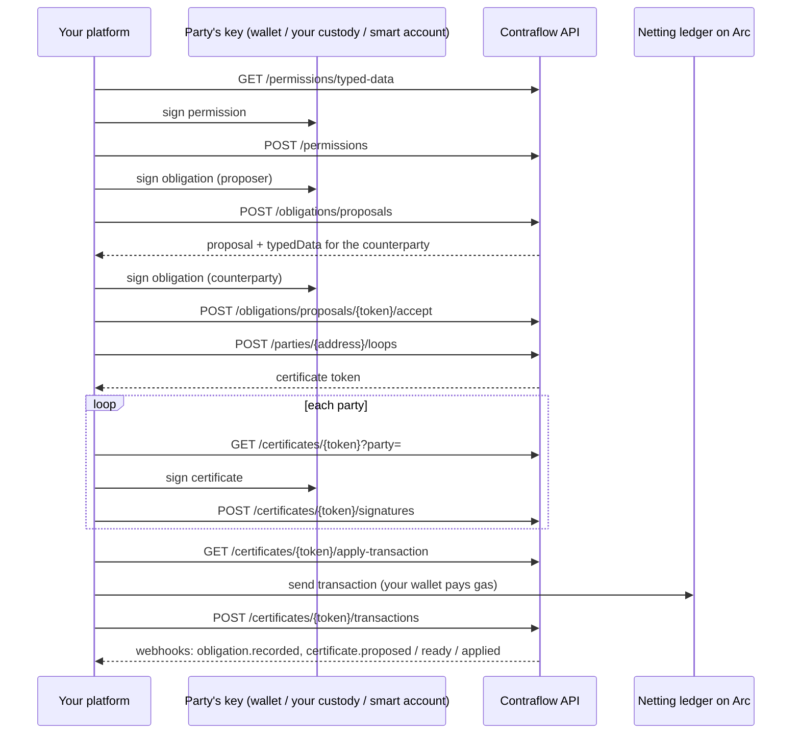

# API reference

The machine contract is the OpenAPI 3.1 document the app serves at `/api/v1/openapi.json`. This page explains how
to use it. For the overview, see [API](../api/README.md).

- **Base path:** `/api/v1`
- **Format:** JSON in, JSON out. List and summary amounts are `amountMinor` (a minor-unit integer string) and
  `amountDisplay` (major units). Timestamps on those responses are unix-second strings. `chainId` is a JSON
  number on the tenant, an apply transaction, a webhook event, and a proposal's domain. Scopes are a small
  integer. Signed documents, EIP-712 fields, and certificate files keep their own names, and the integers in
  those payloads stay decimal strings. In EIP-712 typed-data responses, `domain.chainId` is a JSON number.
- **Amounts:** a list response's `amountMinor` of `"10000"` and `amountDisplay` of `"100.00"` are the same 100.00
  USD. The signed obligation's `amount` stays the minor-unit integer string. The human-readable document's
  `amount` stays major units.
- **Scope:** offchain obligations only. There is no invoice or settlement API.



## Authentication

Send your key as a bearer token:

```
Authorization: Bearer cfk_test_…
```

- **Test and live keys.** Keys starting `cfk_test_` work against Arc testnet. `cfk_live_` keys work against Arc
  mainnet once Contraflow is deployed there; until then they get `403 live_unavailable`. The network always
  comes from the key, never from the request.
- **Issuing keys.** Sign in and create a test key at `/app/api-keys`. Contraflow stores only a hash of each key; the
  secret is shown once. You can hold two active keys at a time, so you can rotate without downtime. Live keys, and
  webhook endpoints, are still issued with the operator script.
- **Failures.** A missing, malformed, unknown or revoked key gets `401 unauthorized`, with
  `WWW-Authenticate: Bearer realm="Contraflow API"`. The scheme is case-insensitive (`Bearer` or `bearer`).
- **Request id.** Send `X-Request-Id` (1–128 visible ASCII characters) and the same value comes back on every
  response. If you omit it, Contraflow generates one.
- **CORS.** Browser clients may call the API from any origin. Allowed headers: `Authorization`, `Content-Type`,
  `Idempotency-Key`, `X-Request-Id`. Wrong methods return JSON `405 method_not_allowed` with `Allow`.
- **Index.** `GET /api/v1` lists the endpoints. `GET /api/v1/openapi.json` is the OpenAPI 3.1 document.

## Acting for a party

Every endpoint except the permission ones, `GET /tenant` and `POST /webhooks/test` act for one party, named in the body (`party`), the query
(`?party=`) or the path (`/parties/{address}`). You need that party's live permission with the right scope:

| Scope | Bit | Lets you |
|---|---|---|
| `read` | 1 | See the party's proposals, obligations and certificates; get the apply transaction; export; report a transaction |
| `propose` | 2 | Propose obligations as the party, withdraw its proposals, search for loops that include it |
| `deliverSignatures` | 4 | Submit signatures the party made: accepting a proposal, signing a certificate |

**No scope lets you sign for the party.** Every obligation and certificate is checked against the party's own
signature.

If you don't hold the permission, the answer is `404 not_found`, the same as for a proposal or certificate that
doesn't exist or doesn't involve the party. The API never confirms what you can't see.

## Idempotency

Send `Idempotency-Key: <1–255 characters>` on every `POST`:

| Situation | Response |
|---|---|
| First request with the key | Runs normally; the response (including a 4xx) is stored |
| Same key, same method, path and body | The stored response, unchanged |
| Same key, different request | `409 idempotency_conflict` |
| Same key while the first request is still pending | If the effect already exists (the proposal by document hash, the accepted obligation, the stored signature, or the reported apply transaction), that result is returned and stored. Otherwise `409 idempotency_in_progress`. This lookup never re-runs the mutation. |
| The first request failed with a 5xx | The key stays reserved. Retry with the same key. If the effect landed, you get that result; otherwise `409 idempotency_in_progress`. Do not mint a new key. |

## Rate limits

Each tenant has a budget of 600 requests a minute (`RateLimit-Limit`, `RateLimit-Remaining`, `RateLimit-Reset`
on every authenticated response; `Retry-After` on 429). Obligation and certificate writes also have a per-party
budget, keyed separately for the web app and for each tenant, so your API traffic doesn't share a party's
browser budget. Past either, you get `429 rate_limited`. If Contraflow's rate limiter itself is unreachable,
requests get `503 unavailable` rather than going through unmetered.

## Errors

Every error has the same shape:

```json
{ "error": { "code": "not_found", "message": "Not found." } }
```

| Status | Codes | When |
|---|---|---|
| 400 | `invalid_json`, `invalid_idempotency_key` | Unparseable body; bad `Idempotency-Key` |
| 401 | `unauthorized` | Missing or invalid key |
| 403 | `live_unavailable`, `chain_unavailable` | Live key before mainnet; a network without the ledger |
| 404 | `not_found` | No permission, not a party, or doesn't exist |
| 405 | `method_not_allowed` | Wrong HTTP method; see `Allow` |
| 409 | `duplicate_nonce`, `idempotency_conflict`, `idempotency_in_progress`, `not_ready` | See each endpoint |
| 422 | `invalid_permission`, `invalid_party`, `invalid_request`, `rejected`, `no_webhook` | The request was understood and refused. `message` says why, for example "Invalid signature." |
| 429 | `rate_limited` | Slow down |
| 500 | `internal_error` | Retry with the same `Idempotency-Key` |
| 503 | `unavailable` | Retry later |

## Tenant

### GET `/tenant`

**200:** `{ "tenantId", "name", "status", "mode", "chainId", "webhookConfigured" }`. `chainId` is a JSON number.
No party permission required.

## Permissions

### GET `/permissions`

Lists grants this tenant holds on the key's chain. Optional `?party=` filters to one address. **200:**
`{ "permissions": [{ "permissionId", "party", "scopes", "expiresAt", "revoked" }] }`.

### GET `/permissions/typed-data`

Builds the EIP-712 payload a party signs to grant you scopes.

| Query | Constraint |
|---|---|
| `party` | Address |
| `scopes` | 1–7, a sum of the scope bits |
| `expiresAt` | Unix seconds, in the future and at most one year ahead |
| `nonce` | 32 random bytes, hex; unique per party |

**200:**

```json
{
  "typedData": {
    "domain": { "name": "Contraflow API", "version": "1", "chainId": 5042002 },
    "types": {
      "ContraflowTenantPermission": [
        { "name": "party", "type": "address" },
        { "name": "tenantId", "type": "bytes32" },
        { "name": "scopes", "type": "uint8" },
        { "name": "expiresAt", "type": "uint64" },
        { "name": "nonce", "type": "bytes32" }
      ]
    },
    "primaryType": "ContraflowTenantPermission",
    "message": {
      "party": "0x504da6d1Cb3cFc170330E2844Da610b2850dFA18",
      "tenantId": "0xc4a4…3bd44",
      "scopes": 7,
      "expiresAt": "1790000000",
      "nonce": "0x5e1f…"
    }
  },
  "digest": "0x…"
}
```

`domain.chainId` is a JSON number so viem (and `cast hash-typed-data`) hash the payload as returned. Other integers stay decimal strings. `digest` is the EIP-712 hash of this typed data; compare it after signing. A string `chainId` hashes to a different digest. The `domain` has no `verifyingContract`: a permission is offchain only.

### POST `/permissions`

Stores a permission after verifying the party's signature: ECDSA first, then ERC-1271 if the party is a smart
account.

```json
{
  "permission": { "party": "0x504d…FA18", "tenantId": "0xc4a4…3bd44", "scopes": 7, "expiresAt": "1790000000", "nonce": "0x5e1f…" },
  "signature": "0x…"
}
```

**201:** `{ "permissionId": "…", "party": "0x504d…FA18", "scopes": 7, "expiresAt": "1790000000" }`

- **422** `invalid_permission`: not signed by the party, wrong tenant, expired, more than a year out, or scopes
  outside 1–7.
- **409** `duplicate_nonce`: the party already used that nonce with you.

### DELETE `/permissions/{permissionId}`

Revokes one of your permissions. **204**, or **404** if it isn't yours or is already revoked.

## Obligations

### POST `/obligations/proposals`

Scope: `propose` (as `party`, the proposer).

```json
{
  "party": "0x504da6d1Cb3cFc170330E2844Da610b2850dFA18",
  "proposerRole": "debtor",
  "document": {
    "format": "contraflow-obligation/1",
    "description": "Invoice 1042, October media buy",
    "debtor": "0x504da6d1Cb3cFc170330E2844Da610b2850dFA18",
    "creditor": "0x71E36E350Bc4c3C5eCCc193955C456f8B1C6fF75",
    "currency": "USD",
    "amount": "100.00",
    "maturity": "2026-12-31",
    "earlyNetConsent": true
  },
  "obligation": {
    "documentHash": "0x…",
    "debtor": "0x504d…FA18",
    "creditor": "0x71E3…fF75",
    "currency": "USD",
    "amount": "10000",
    "maturity": "1798675200",
    "earlyNetConsent": true,
    "salt": "0x…"
  },
  "proposerSignature": "0x…"
}
```

**How to build it:**
- `document.amount` is in major units, exactly as shown to the parties. `obligation.amount` is the same value in
  minor units.
- `documentHash` is `keccak256` of the canonical document (see
  [Offchain netting](offchain-netting.md#obligation)). Both parties, and Contraflow, must derive it identically:

```ts
import { keccak256, toHex, type Address } from "viem";

const FORMAT = "contraflow-obligation/1";

export function buildObligationDocument(fields: {
  description: string;
  debtor: Address;
  creditor: Address;
  currency: string;
  amount: string; // major units, e.g. "1250.00"
  maturity: string; // yyyy-mm-dd
  earlyNetConsent: boolean;
}) {
  return { format: FORMAT, ...fields };
}

export function canonicalizeObligationDocument(doc: ReturnType<typeof buildObligationDocument>): string {
  return JSON.stringify({
    amount: doc.amount,
    creditor: doc.creditor.toLowerCase(),
    currency: doc.currency,
    debtor: doc.debtor.toLowerCase(),
    description: doc.description.trim(),
    earlyNetConsent: doc.earlyNetConsent,
    format: doc.format,
    maturity: doc.maturity,
  });
}

export function hashObligationDocument(doc: ReturnType<typeof buildObligationDocument>): `0x${string}` {
  return keccak256(toHex(canonicalizeObligationDocument(doc)));
}
```

Known hashes (debtor `0xe05fcc23807536bee418f142d19fa0d21bb0cff7`, creditor
`0x0376aac07ad725e01357b1725b5cec61ae10473c`):

| Document | `documentHash` |
|---|---|
| USD 1250.00, "INV-1042: consulting, September 2026", maturity 2026-10-31, early net | `0xb59a4a60e4c91912945825b3e037b0034d71f899eeab1247967e9e3a423208ff` |
| EUR 100.00, "Freight invoice 88", maturity 2027-01-15, no early net | `0xee54b80d177f5ae0950334b743022ebc67f677c2375d7913d8a8d2e639814da4` |
| JPY 25000, "Yen retainer", maturity 2026-12-01, early net | `0x074efe5c0950a65575be0fe7082ef13ed953b34bb612961d74d16f1d95c89571` |

- `maturity` is midnight UTC of the date.
- `salt` is 32 random bytes.
- The proposer signs the `NettingObligation` typed data under the ledger's domain.

**201:** the proposal, with `typedData`, the exact payload the counterparty signs:

```json
{
  "proposal": {
    "token": "MD96bl3WBFS5R5fgRBkuTQ",
    "state": "open",
    "viewerRole": "proposer",
    "proposerRole": "debtor",
    "domain": { "chainId": 5042002, "verifyingContract": "0x2F5996aaE68CbC8026543c405Cc81C26D58c2ef7" },
    "obligation": { "…": "as submitted" },
    "document": { "…": "as submitted" },
    "proposerSignature": "0x…",
    "expiresAt": "1793021341",
    "typedData": { "domain": { "name": "ContraflowNettingLedger", "version": "1", "chainId": 5042002, "verifyingContract": "0x2F59…2ef7" }, "types": { "NettingObligation": ["…"] }, "primaryType": "NettingObligation", "message": { "…": "…" } },
    "digest": "0x…"
  }
}
```

**422** `rejected` is returned, with the reason in `message`, when:
- the document doesn't match the obligation;
- the signature isn't the proposer's;
- an address is screened out;
- the same document is already recorded between these parties.

A proposal expires after 30 days.

### GET `/obligations/proposals/{token}?party=`

Scope: `read`. **200:** `{ "proposal": { … as above } }`.

### POST `/obligations/proposals/{token}/accept`

Scope: `deliverSignatures` (as the counterparty).

```json
{ "party": "0x71E36E350Bc4c3C5eCCc193955C456f8B1C6fF75", "signature": "0x…" }
```

**200:** `{ "accepted": true }`. The stored proposal is re-validated from scratch before the obligation is
recorded.

### DELETE `/obligations/proposals/{token}?party=`

Scope: `propose`. Withdraws an open proposal. **204**.

### GET `/parties/{address}/obligations`

Scope: `read`. It brings any certificate the ledger has applied up to date first.

```json
{
  "proposals": [
    { "token": "…", "waitingOn": "them", "youOwe": true, "counterparty": "0x…", "currency": "USD", "amountMinor": "10000", "amountDisplay": "100.00", "description": "…", "expiresAt": "1793021341" }
  ],
  "obligations": [
    { "obligationId": "0x…", "youOwe": false, "counterparty": "0x…", "currency": "USD", "amountMinor": "10000", "amountDisplay": "100.00", "remainingMinor": "0", "remainingDisplay": "0.00", "maturity": "1798675200", "description": "…", "status": "active" }
  ],
  "certificates": [
    { "token": "zWa9t3gHKtmQZY3uiBvJQg", "status": "applied", "currency": "USD", "wNetMinor": "10000", "wNetDisplay": "100.00", "deadline": "1791100000", "parties": 3, "signedCount": 3, "youSigned": true, "appliedTxHash": "0x9ff3…7a00" }
  ],
  "nextCursor": null
}
```

Optional `?limit=` (1–100, default 50) and `?cursor=` (the previous page's `nextCursor`). Order is proposals, then
obligations, then certificates, each by id. `nextCursor` is `null` when this is the last page.

Obligation `status` is `active`, `closed` or `out_of_sync`. The last means the stored state disagrees with the
ledger, and the obligation won't be netted until that's resolved.

### POST `/parties/{address}/loops`

Scope: `propose`. Searches for a loop including the party and proposes a certificate if it finds one.

```json
{ "outcome": { "found": true, "token": "zWa9t3gHKtmQZY3uiBvJQg", "currency": "USD", "wNetMinor": "10000", "wNetDisplay": "100.00", "parties": 3 } }
```

or

```json
{ "outcome": { "found": false, "reason": "no-loop", "message": "…" } }
```

`reason` is `no-candidates`, `no-loop`, `too-many-parties`, `search-incomplete` or `out-of-sync`.

## Certificates

### GET `/certificates/{token}?party=`

Scope: `read`. Returns the party's view and the typed data it signs.

```json
{
  "certificate": {
    "token": "zWa9t3gHKtmQZY3uiBvJQg",
    "status": "collecting",
    "currency": "USD",
    "wNetMinor": "10000",
    "wNetDisplay": "100.00",
    "deadline": "1791100000",
    "parties": 3,
    "signedCount": 1,
    "yourIndex": 0,
    "youSigned": false,
    "appliedTxHash": null,
    "view": { "format": "contraflow-netting-certificate/1", "…": "the party's view; see Offchain netting" }
  },
  "typedData": { "domain": { "name": "ContraflowNettingLedger", "version": "1", "chainId": 5042002, "verifyingContract": "0x2F59…2ef7" }, "primaryType": "NettingCertificate", "message": { "…": "…" } },
  "digest": "0x…"
}
```

`status` is `collecting`, `ready`, `applied`, `expired` or `abandoned`. `view` holds this party's own obligations
in full and every other entry as a hash only.

### POST `/certificates/{token}/signatures`

Scope: `deliverSignatures`. `{ "party": "0x…", "signature": "0x…" }` → **200** `{ "signed": true }`.

- **What the party signs:** the certificate's EIP-712 digest, once, as the debtor of its entry.
- **Checks:** the signature is verified against the chain before it's stored.
- **Completion:** when the last party signs, the status becomes `ready`.

### GET `/certificates/{token}/apply-transaction?party=`

Scope: `read`. **409** `not_ready` until every party has signed.

```json
{
  "chainId": 5042002,
  "to": "0x2F5996aaE68CbC8026543c405Cc81C26D58c2ef7",
  "value": "0",
  "data": "0x…",
  "note": "Submit this from your own wallet; the sender pays the gas. Then report the hash to /transactions."
}
```

`data` is `applyCertificate(certificate, signatures)`. Anyone can submit it; Contraflow never does, and doesn't
sponsor the gas. A 3-party certificate costs about 0.0042 USDC in gas on Arc testnet.

### POST `/certificates/{token}/transactions`

Scope: `read`. `{ "party": "0x…", "txHash": "0x…" }` → **200** `{ "status": "applied" }`.

This reads the ledger and brings the certificate and its obligations up to date straight away. It isn't
required: Contraflow also catches up the next time the certificate or the party's obligations are read.

### GET `/certificates/{token}/export?party=`

Scope: `read`. **200:** `{ "fileName": "contraflow-certificate-1f00cc58.json", "certificate": { … } }`. The file is
the party's `contraflow-netting-certificate/1` view, which anyone can check on **Verify a certificate**.

## Webhooks

Contraflow registers one HTTPS endpoint per tenant and gives you a signing secret (`whsec_…`), shown once. Events:

| Type | When |
|---|---|
| `obligation.recorded` | Both parties have signed an obligation |
| `certificate.proposed` | A loop was found and a certificate proposed |
| `certificate.ready` | Every party has signed |
| `certificate.applied` | The ledger applied it |
| `certificate.expired` | Its deadline passed unapplied |
| `certificate.cancelled` | A party declined, or closed an obligation in it |
| `webhook.test` | You called `POST /webhooks/test` |

- **Delivery schedule.** Each authenticated API request (and each web-app obligation write) runs the pipeline in
  a Next.js `after()` hook once the response is sent. Vercel Hobby only allows a daily cron, so
  `/api/cron/webhooks` at 04:15 UTC is the retry backstop, not the primary scheduler. On Pro the same cron can
  run every minute.
- **Which events you get:** only those about parties that granted you `read` (`webhook.test` names none).
- **What they name:** only those parties, never others in the loop.
- **Permission at delivery:** immediately before each delivery attempt, Contraflow checks that your tenant is
  active and still has unexpired, unrevoked `read` permission for every party named in the event. If access has
  been revoked, expired or suspended, the event is marked `suppressed` and isn't sent. If the permission check
  service is temporarily unavailable, Contraflow sends nothing and retries later.
- **Changes made elsewhere:** events also fire for changes made in the Contraflow web app, such as a
  counterparty signing there.

```json
{
  "id": "evt_41_c4a42fd5e0d427c0",
  "type": "certificate.applied",
  "created": 1790000000,
  "chainId": 5042002,
  "data": {
    "certificateId": "0x1f00cc58f52f7a85ada8fcbeca335feba55fab73f59418145b62de4f3574b4e7",
    "token": "zWa9t3gHKtmQZY3uiBvJQg",
    "status": "applied",
    "parties": ["0x504da6d1Cb3cFc170330E2844Da610b2850dFA18"]
  }
}
```

`obligation.recorded` carries `{ "obligationId": "0x…", "parties": [ … ] }` in `data`.

### Verifying a webhook

Each request carries `Contraflow-Signature: t=<unix>,v1=<hex>` and `Contraflow-Event-Id`. `v1` is HMAC-SHA256 of
`"<t>.<raw body>"` with your secret, the same scheme as Stripe. While a secret is being rotated, the header
carries a `v1` for each active secret for 24 hours.

```ts
import { createHmac, timingSafeEqual } from "node:crypto";

function verify(header: string, rawBody: string, secret: string, now = Date.now() / 1000): boolean {
  const parts = header.split(",").map((p) => p.split("="));
  const t = Number(parts.find(([k]) => k === "t")?.[1]);
  if (!Number.isInteger(t) || Math.abs(now - t) > 300) return false; // 5-minute tolerance
  const expected = createHmac("sha256", secret).update(`${t}.${rawBody}`).digest();
  return parts
    .filter(([k]) => k === "v1")
    .some(([, v]) => {
      const given = Buffer.from(v, "hex");
      return given.length === expected.length && timingSafeEqual(given, expected);
    });
}
```

- **Verify against the raw body.** Do it before parsing, since re-serialised JSON won't match.
- **De-duplicate.** Use the event `id`: a delivery can arrive more than once.
- **Respond quickly.** Return any 2xx; anything else, a redirect or a timeout (10 seconds) is a failure.
- **Retries.** Failed deliveries retry after 1, 2, 4… minutes, capped at 6 hours between tries, for up to 3 days.
- **Order.** Events aren't guaranteed to arrive in order. Use the certificate's `status`, or read it back through
  the API.

### POST `/webhooks/test`

Queues a `webhook.test` event for your registered HTTPS endpoint and runs the delivery pipeline after the
response. **202:** `{ "eventId": "evt_test_…", "type": "webhook.test" }`. **422** `no_webhook` if no URL is
registered. Use this to prove the endpoint and signature check work; don't wait for the daily cron.
