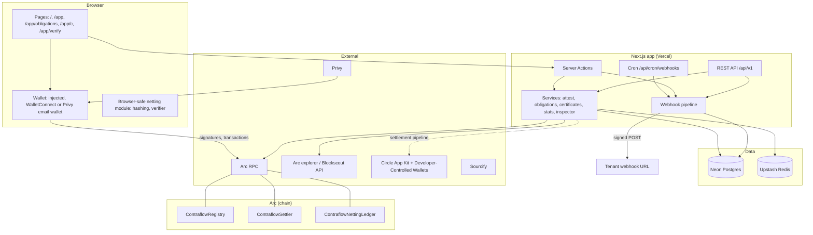
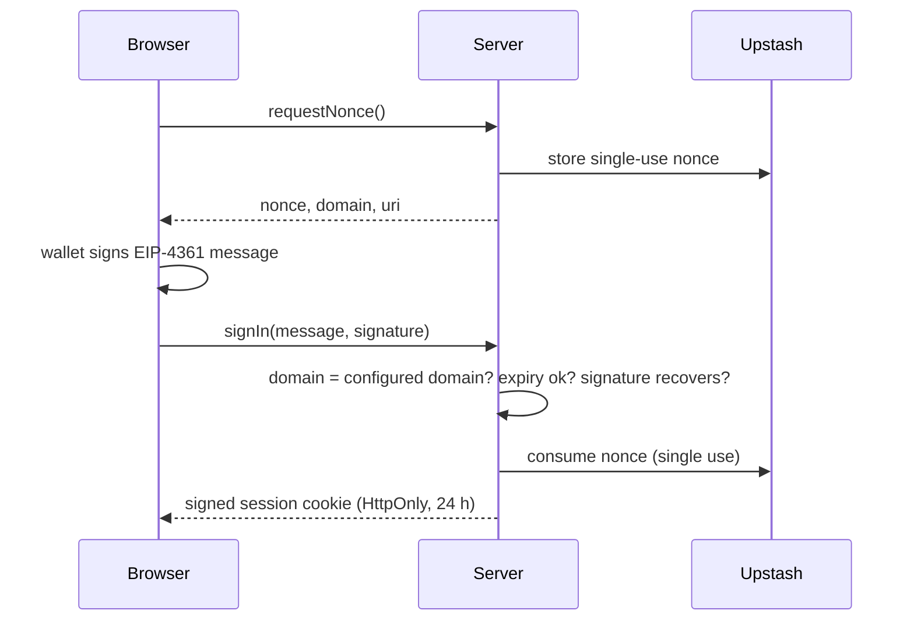
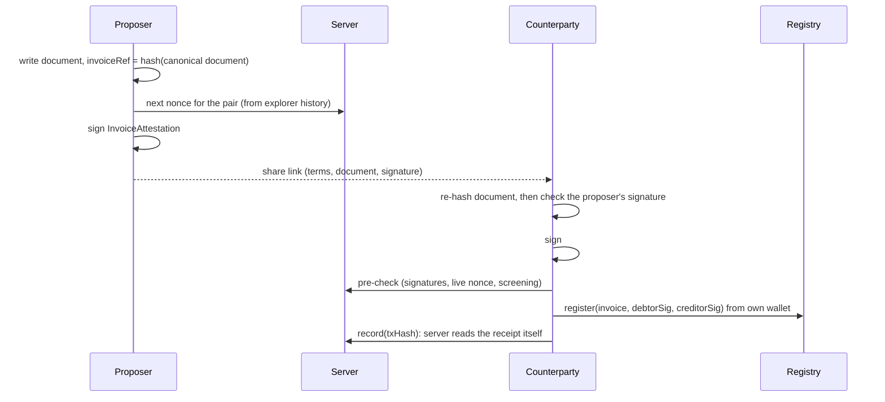

# Architecture

Contraflow is a Next.js application on Vercel, three contracts on Arc, and a handful of managed services. It never
holds funds: the contracts reduce signed debts in place, and the server only stores, checks and relays signatures
that parties made.

## System overview

## Modules

Everything server-side lives in `app/src/`. Pages and Server Actions are in `app/app/`.

| Module | Role | Key files |
|---|---|---|
| `attest` | Invoice proposal and registration: canonical document hash, share link, next-nonce lookup, pre-check before submission, recording the result, starter gas grant | `document.ts`, `link.ts`, `nextNonce.ts`, `precheck.ts`, `record.ts`, `starterGrant.ts` |
| `actions` | Invoice registration, settlement and the server-side settlement pipeline | `register.ts`, `settle.ts`, `pipeline.ts` |
| `netting` | Offchain netting primitives. Browser-safe: runs in both parties' browsers. | `document.ts`, `obligation.ts`, `commitment.ts`, `certificate.ts`, `serialize.ts`, `signature.ts`, `verify.ts` |
| `obligations` | Server-side obligation and certificate services: proposals, loop search, certificate collection, ledger sync | `service.ts`, `loopSearch.ts`, `proposeLoop.ts`, `certificates.ts` |
| `api` | REST API v1: keys, party permissions, handlers, HTTP layer, webhooks | `auth.ts`, `permissions.ts`, `handlers.ts`, `http.ts`, `webhookPipeline.ts` |
| `siwe`, `session` | Sign-in with Ethereum and the signed session cookie | `message.ts`, `verifySignIn.ts`, `nonce.ts`, `cookie.ts` |
| `db` | Data access for Neon, with transient-failure retries | `client.ts`, `invoices.ts`, `obligations.ts`, `certificates.ts`, `tenants.ts`, `webhooks.ts` |
| `blockscout` | Explorer client and invoice reconciliation | `client.ts`, `reconcile.ts` |
| `stats` | Protocol stats counted from contract events | `indexer.ts`, `aggregate.ts`, `load.ts` |
| `inspector` | Onchain facts about the parties to an invoice or loop | `signals.ts`, `load.ts` |
| `compliance` | Address screening against a maintained list | `screen.ts`, `providers.ts` |
| `kits`, `dcw`, `operator` | Circle App Kit (Swap Kit quotes, Unified Balance), Developer-Controlled Wallets, the operator signer. The EURC quote runs server-side from a throwaway key that holds nothing; Gateway balances, deposits and moves for users run in the browser with the user's own wallet. | `swap.ts`, `quote.ts`, `unifiedBalance.ts`, `browserAdapter.ts`, `gatewayChains.ts`, `gatewayBalance.ts`, `contractExecution.ts`, `signer.ts` |
| `chain`, `contracts` | viem clients, ABIs, addresses per chain | `client.ts`, `addresses.ts`, `abi/` |
| `ratelimit`, `upstash` | Fixed-window rate limiting on Upstash | `limiter.ts`, `client.ts` |

The loop-finding solver is its own package, `packages/solver`. It builds a graph and enumerates bounded simple
cycles, requiring distinct parties for anything proposed onchain.

## What runs where

| In the browser | On the server |
|---|---|
| Building and hashing invoice and obligation documents | Re-deriving and re-checking everything the browser sends |
| Every signature, through the user's wallet | Signature checks against the chain (including ERC-1271) |
| Checking a counterparty's signature and document before signing | Storing obligations, proposals and certificates |
| Checking a certificate before signing it | Loop search and certificate building |
| Submitting `register` and `applyCertificate` from the user's wallet | The starter gas grant, the one transaction the operator key sends for a user |
| `/app/verify`, entirely | Reconciliation with the chain, protocol stats, webhooks |
| Gateway balance, deposits and moves to Arc, between the user's wallet and Circle | EURC quotes, with the amount read from the Registry |

Neither side trusts the other. The browser re-checks what the server returns, and the server re-validates what the
browser submits.

## Flows

### Sign in

The session holds only the wallet address. Every action takes the caller's address from the session, never from a
request field.

### Invoice on Arc

Settling a loop is permissionless: anyone can call `settle(ids, wNet)` with a valid loop. The live demo does this
from Contraflow's operator wallet.

### Offchain obligation and certificate

See [Offchain netting](offchain-netting.md) for the full sequence and state machine. In short:

1. Both parties sign an obligation, and the server stores it.
2. A loop search proposes a certificate.
3. Each party checks and signs it.
4. Anyone applies it on the ledger.
5. The server syncs from the ledger.

### API and webhooks

API requests go through `route()` in `src/api/http.ts`, which handles authentication, rate limits and idempotency,
then call the same services as the web app, acting for the party named in the request. Changes to obligations and
certificates are captured by Postgres triggers into a change log, whichever path made them. After each API request
and web-app action, and daily from Vercel Cron, a pipeline turns changes into signed webhook events and delivers
them. See [API reference](api.md#webhooks).

## Data stores

| Store | Holds | Notes |
|---|---|---|
| Arc | Invoices, settlements, obligation commitments, applied certificates | The source of truth for everything onchain |
| Neon Postgres | A cache of onchain invoices, invoice descriptions, obligations, certificates, API tenants and webhooks | Reconciled against the chain; see [Data model](data-model.md) |
| Upstash Redis | Sign-in nonces, rate-limit counters, short-lived caches (stats, inspector), locks | Nothing permanent |
| Blockscout | Read-only: contract logs, transactions, token transfers | Used for reconciliation, stats and the inspector |

## Settlement pipeline

`runSettlementPipeline` (`src/actions/pipeline.ts`) is operator tooling: it runs server-side with the operator's
own credentials, and no page calls it. It composes the Circle integrations:

1. Register invoices.
2. Settle the best loop.
3. Find invoices no loop reached.
4. Optionally, get a Swap Kit quote (USDC to EURC, quote only), and fund a balance on Arc from USDC on another
   chain through Unified Balance / Gateway.

A Gateway failure after the deposit has landed can be resumed without depositing again. None of this is called from
the contracts: the contracts never touch a token.

The user-facing versions of step 4 are separate:
- **Quote in EURC** is a public Server Action. It takes only an invoice id, reads the remaining amount from the
  Registry, and quotes from a key that holds no funds. It's rate-limited per IP (failing closed) and cached for 60
  seconds per amount.
- **Bring USDC from another chain** (`/app/balance`) runs entirely in the browser. App Kit is driven by the user's
  own wallet: it deposits into Gateway on the source chain, then spends to the user's own address on Arc through
  Circle's forwarder, so no Arc gas is needed. The server only serves the page and never sees a signature.
