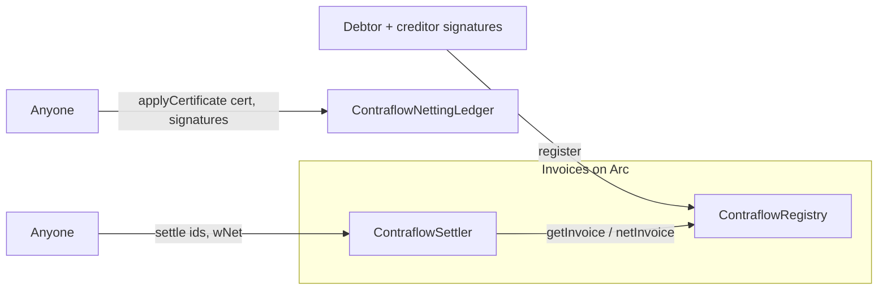
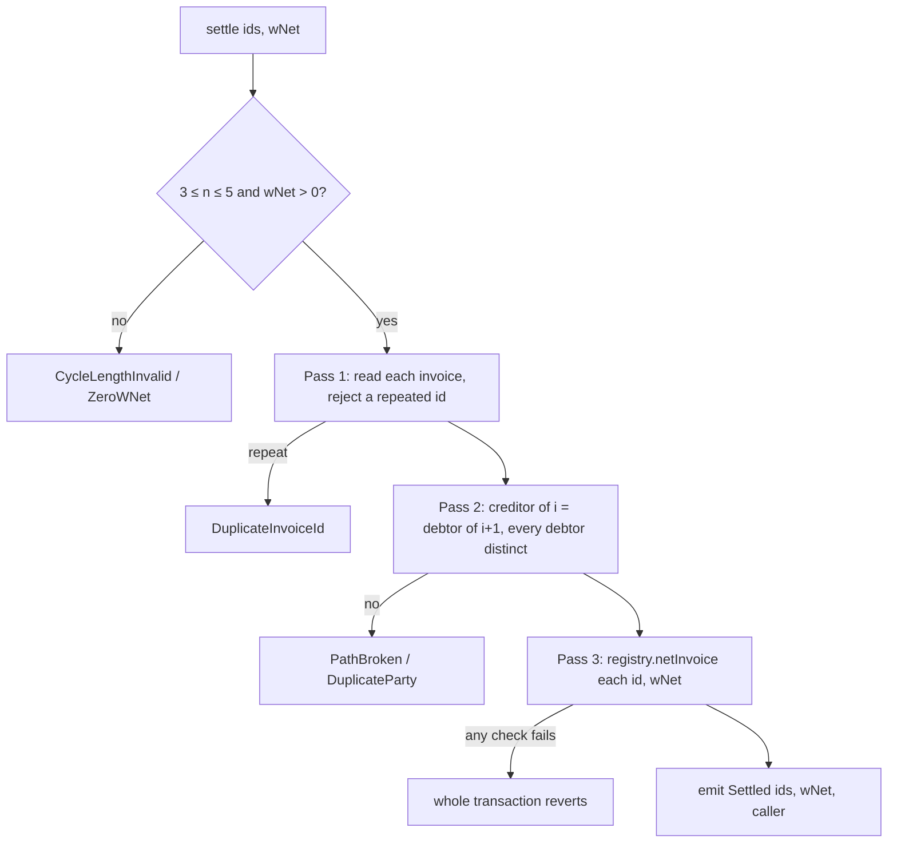

# Contracts

Contraflow has three contracts on Arc. None of them holds funds or calls a token contract: they record signed
debts and reduce them in place.

| Contract | What it does |
|---|---|
| `ContraflowRegistry` | Stores USDC invoices both parties signed, and is the only place an invoice's remaining amount can change. |
| `ContraflowSettler` | Checks that a set of invoices forms a closed loop and reduces every one of them by the same amount, in one transaction. |
| `ContraflowNettingLedger` | Records a blinded state for each offchain obligation, advanced only by a netting certificate every party in the loop signed. |

All three are written for Solidity `0.8.36` and OpenZeppelin v5, and sit behind ERC-1967 proxies. (The current
testnet deployment was compiled with `0.8.37`; the source was pinned to `0.8.36` afterwards so the Arc explorer can
verify it.) See
[Upgradeability](#upgradeability).



## Addresses

The app reads addresses from `app/src/contracts/addresses.ts`. The deployment records are in
`contracts/deployments/`.

| Network | Chain ID | Registry | Settler | Netting ledger | USDC (ERC-20) |
|---|---|---|---|---|---|
| Arc testnet | `5042002` | `0x304450Dc27f644AcA55773895409ff500AFb2Bf7` | `0x25851c3fa9438AA53B0bd6ecc3347010b3ccB015` | `0x2F5996aaE68CbC8026543c405Cc81C26D58c2ef7` | `0x3600000000000000000000000000000000000000` |
| Arc | `5042` | Added at the mainnet deploy | | | |

These are the proxy addresses. The source of every contract is verified on Sourcify.

## ContraflowRegistry

### Invoice attestation (EIP-712)

Domain: `{ name: "ContraflowRegistry", version: "1", chainId, verifyingContract: <registry> }`.

```
InvoiceAttestation(bytes32 invoiceRef,uint256 amount,address currency,uint64 maturity,bool earlyNetConsent,address debtor,address creditor,uint256 nonce,address registry,uint256 chainId)
```

| Field | Meaning |
|---|---|
| `invoiceRef` | Hash of the invoice document both parties saw (the app hashes a canonical document; see [Security](security.md#invoice-and-obligation-documents)). |
| `amount` | USDC in 6-decimal base units. Must be non-zero. |
| `currency` | Must equal the registry's `usdc`. |
| `maturity` | Unix seconds. Before it, the invoice nets only with `earlyNetConsent`. |
| `earlyNetConsent` | Both parties agree it can be netted before maturity. |
| `debtor`, `creditor` | Must be different, non-zero addresses, and each must sign. |
| `nonce` | Exactly one more than the last nonce registered for this debtor and creditor, starting at 1. |
| `registry`, `chainId` | Must equal this contract and `block.chainid`, so a signature can't be replayed elsewhere. |

The invoice ID is the EIP-712 digest itself.

### Functions

| Function | Who | Behaviour |
|---|---|---|
| `register(InvoiceAttestation invoice, bytes debtorSignature, bytes creditorSignature) → bytes32 id` | Anyone | Checks every field above, recovers both signatures (OpenZeppelin ECDSA: 65 bytes, low-s only), enforces the next nonce, stores the invoice as `Active`, emits `InvoiceRegistered`. |
| `getInvoice(bytes32 id) → Invoice` | View | Reverts `InvoiceNotFound` for an unknown ID. |
| `netInvoice(bytes32 id, uint256 wNet) → uint256 remainingAfter` | Settler only | Checks the invoice is `Active`, nettable (matured or early-consented), and has at least `wNet` remaining; subtracts; marks it `ExtinguishedOnchain` (the enum name for "fully netted", not a legal statement) at zero; emits `InvoiceNetted`. |
| `usdc()`, `settler()` | View | The configured USDC token and settler. |

The stored `Invoice` is `{debtor, maturity, earlyNetConsent, status, creditor, amountRemaining, nonce}`, packed
into four storage slots.

### Events and errors

| Event | Emitted |
|---|---|
| `InvoiceRegistered(bytes32 indexed id, address indexed debtor, address indexed creditor, uint256 amount, uint64 maturity, bool earlyNetConsent, uint256 nonce)` | On `register` |
| `InvoiceNetted(bytes32 indexed id, uint256 wNet, uint256 remainingAfter, InvoiceStatus status)` | Once per invoice in a settlement |

| Error | When |
|---|---|
| `InvalidSignature(address expectedSigner)` | A signature doesn't recover to the named party |
| `NonceNotSequential(uint256 provided, uint256 expected)` | The nonce isn't exactly the next one for the pair |
| `CurrencyMismatch`, `RegistryMismatch`, `ChainIdMismatch` | The attestation is for another token, contract or chain |
| `ZeroAmount`, `ZeroAddress`, `SelfInvoice(address)` | Malformed attestation |
| `InvoiceAlreadyRegistered(bytes32 id)` | The same attestation was registered before |
| `InvoiceNotFound`, `InvoiceNotActive`, `InvoiceNotNettable` | `getInvoice` / `netInvoice` on an unknown, fully netted or not-yet-nettable invoice |
| `AmountExceedsRemaining(bytes32 id, uint256 wNet, uint256 remaining)` | `wNet` is larger than what's left |
| `NotSettler(address caller)` | `netInvoice` from anyone but the settler |

## ContraflowSettler

`settle(bytes32[] invoiceIds, uint256 wNet)` is permissionless. It runs in three passes and reverts entirely on any
failure:



| Event / error | Meaning |
|---|---|
| `Settled(bytes32[] invoiceIds, uint256 wNet, address indexed caller)` | One per successful settlement |
| `CycleLengthInvalid(uint256 length)` | Fewer than 3 or more than 5 invoices |
| `PathBroken(uint256 index)` | Invoice `index`'s creditor isn't the next invoice's debtor |
| `DuplicateInvoiceId(bytes32 id)` | An invoice appears twice |
| `DuplicateParty(address party)` | A party appears twice, so it's not a simple loop |
| `ZeroWNet()`, `ZeroAddress()` | Invalid input |

No token moves: every invoice's remaining amount goes down by `wNet`, and nothing else changes.

## ContraflowNettingLedger

The ledger stores one 32-byte commitment per obligation and a flag per applied certificate. It never sees amounts,
currencies or documents. The protocol is described in [Offchain netting](offchain-netting.md).

Domain: `{ name: "ContraflowNettingLedger", version: "1", chainId, verifyingContract: <ledger> }`.

```
NettingObligation(bytes32 documentHash,address debtor,address creditor,string currency,uint256 amount,uint64 maturity,bool earlyNetConsent,bytes32 salt)
CertificateEntry(bytes32 obligationId,address debtor,address creditor,bytes32 priorCommitment,bytes32 nextCommitment)
NettingCertificate(bytes32 certificateId,bytes32 contentHash,uint64 deadline,CertificateEntry[] entries)CertificateEntry(...)
```

The obligation type is signed offchain and never submitted. The ledger exposes its hashing (`obligationId`) so
offchain code can be checked against it.

### Functions

| Function | Behaviour |
|---|---|
| `applyCertificate(NettingCertificate cert, bytes[] signatures)` | Permissionless. See the checks below. Advances every entry's commitment and marks the certificate applied. |
| `stateOf(bytes32 key) → bytes32` | The obligation's current commitment; zero if never netted. |
| `isApplied(bytes32 certificateId) → bool` | Whether the certificate was applied. |
| `obligationKey(bytes32 obligationId, address debtor, address creditor) → bytes32` | `keccak256(abi.encode(obligationId, debtor, creditor))`, the storage key. |
| `obligationId(NettingObligation) → bytes32` | The EIP-712 digest of an obligation, which is its ID. |
| `certificateDigest(NettingCertificate) → bytes32` | The EIP-712 digest every party signs. |

### applyCertificate checks, in order

| # | Check | Error |
|---|---|---|
| 1 | `certificateId` is non-zero | `ZeroCertificateId` |
| 2 | `block.timestamp ≤ deadline` | `CertificateExpired(deadline, now)` |
| 3 | Not already applied | `CertificateAlreadyApplied(id)` |
| 4 | 2 ≤ entries ≤ 5 | `CycleLengthInvalid(n)` |
| 5 | One signature per entry | `SignatureCountMismatch(entries, signatures)` |
| 6 | Each entry: non-zero parties; creditor is the next entry's debtor; debtors distinct | `ZeroAddress`, `PathBroken(i)`, `DuplicateParty(party)` |
| 7 | Each entry: `nextCommitment` non-zero and different from `priorCommitment` | `ZeroCommitment(i)`, `CommitmentUnchanged(i)` |
| 8 | `signatures[i]` is entry `i`'s debtor over `certificateDigest`: ECDSA first, then ERC-1271 for a signer with code | `InvalidSignature(signer)` |
| 9 | Each entry's `priorCommitment` equals `stateOf(obligationKey(...))` | `StaleCommitment(key, current, provided)` |

On success each obligation's state becomes its `nextCommitment`, and the ledger emits one
`ObligationAdvanced(bytes32 indexed obligationKey, bytes32 indexed certificateId, bytes32 priorCommitment,
bytes32 nextCommitment)` per entry, then `CertificateApplied(bytes32 indexed certificateId, bytes32 contentHash,
address indexed submitter)`.

In a loop every party is the debtor on one entry and the creditor on another, so one signature per entry covers
both parties of every obligation.

## Gas

Measured on Arc testnet:

| Operation | Gas |
|---|---|
| `register` | 168,563 |
| `settle`, 3 invoices | 101,129 |
| `settle`, 4 invoices | 121,601 |
| `settle`, 5 invoices | 142,165 |
| `applyCertificate`, 2 / 3 / 5 obligations (execution only) | 96,870 / 129,680 / 196,773 |
| `applyCertificate`, 2 obligations, full transaction | 131,527 |

The `register` and `settle` figures are full transactions measured on 18 September 2026, before the
distinct-party check (`DuplicateParty`) was added to `settle`. That check compares at most five addresses. Gas on
Arc is paid in native USDC.

## Upgradeability

All three contracts are UUPS-upgradeable. Each has a plain `Ownable` owner, a single administrative key held by
the team. It is the only address that can authorise an upgrade (`_authorizeUpgrade` is `onlyOwner`), and it has no
other power: it can't register, settle, apply or edit an invoice or obligation directly. An upgrade can change how
the contracts behave from then on.

Every contract reserves a 50-slot storage budget, with a `__gap` that shrinks when a later version adds state.
Implementations disable their initialisers in the constructor, and each proxy is deployed and initialised in a
single transaction, so `initialize` runs exactly once:

| Contract | `initialize` |
|---|---|
| Registry | `initialize(address usdcToken, address settler, address owner)` |
| Settler | `initialize(address registry, address owner)` |
| Netting ledger | `initialize(address owner)` |
