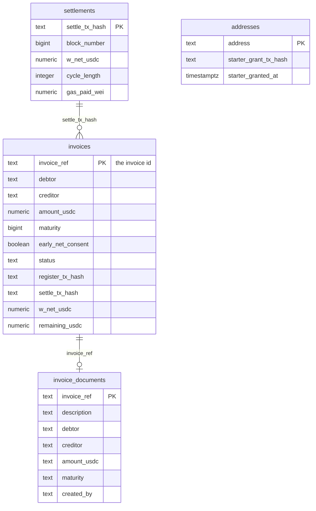
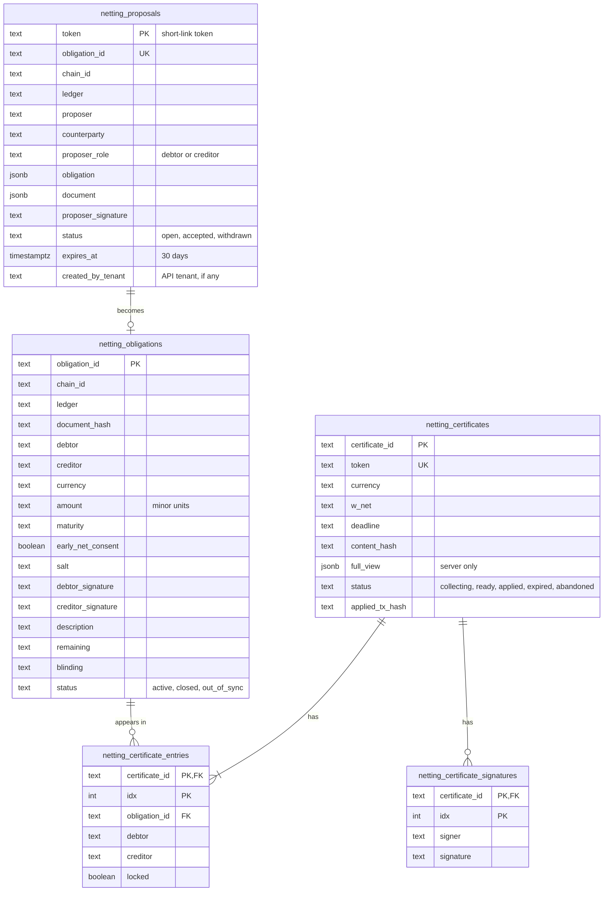
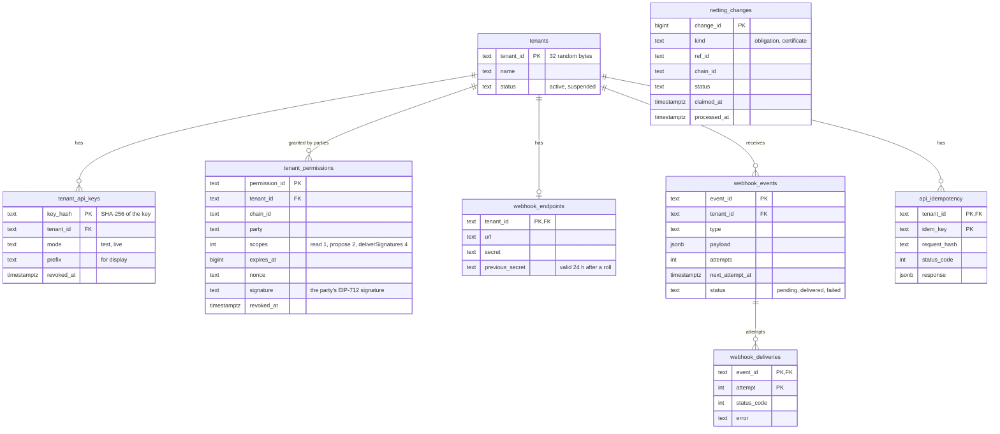

# Data model

Contraflow keeps data in three places: Arc (the source of truth for everything onchain), Neon Postgres, and
Upstash Redis. The Postgres schema is created by the SQL migrations in `app/src/db/migrations/`, which can safely
be run more than once. Addresses and hex values are stored lowercase.

## Invoices (cache of onchain data)

These tables mirror what's on Arc so pages load fast. They're reconciled against the explorer and never trusted
over the chain. Anything missing is rebuilt from the Registry's event log.

| Table | Who can read it |
|---|---|
| `invoices`, `settlements` | Public through the app, since the data is public onchain |
| `invoice_documents` | The invoice's two parties only, through session-checked actions. It's never joined into a public query. |
| `addresses` | Server only: which addresses have had the one-time starter gas grant |

## Offchain obligations

- **Party-only.** Every one of these tables is readable only by the parties involved (or a tenant holding a
  party's permission), through service functions that check the caller. None is joined into a public query.
- **`full_view`.** A certificate's `full_view` holds every entry's amounts and blindings. It never leaves the
  server: each party receives only its own view.
- **One open certificate per obligation.** A partial unique index on `netting_certificate_entries (obligation_id)
  WHERE locked` enforces it. Closing a certificate unlocks its entries in the same transaction.
- **The database follows the ledger.** `remaining` and `blinding` advance only after the ledger reports the
  certificate applied and the stored state reproduces the onchain commitment.

## API

`netting_changes` is written by triggers on `netting_obligations` (insert) and `netting_certificates` (insert and
status change). The webhook pipeline turns each change into events for tenants with `read` permission from a party
it touches. None of the API tables is readable outside the server.

## Upstash Redis

Nothing in Redis is permanent. Losing it would cancel sign-ins in progress and reset caches and rate-limit windows, but lose no data. Sessions are signed cookies, not Redis entries.

| Key | Holds | Lifetime |
|---|---|---|
| Sign-in nonces | Issued, unused SIWE nonces | 5 minutes; deleted on first use |
| Rate-limit counters | Per-IP, per-party and per-tenant request counts | The limit's window |
| Inspector cache | Onchain facts about an address or loop | 10 minutes |
| Protocol stats | Running totals and the explorer cursor | Until rebuilt, at least daily |
| Locks | Stats refresh, webhook pipeline | Seconds; released when done |

## Onchain

| Contract | Stores |
|---|---|
| Registry | Every invoice's parties, maturity, early-netting consent, status, remaining amount and nonce; the last nonce per pair |
| Settler | Only its registry address |
| Netting ledger | One blinded commitment per obligation key; whether each certificate ID has been applied |

Amounts of offchain obligations, their currencies and all descriptions are never onchain.
