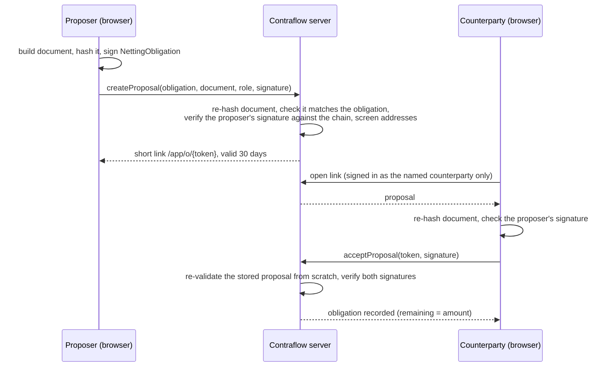
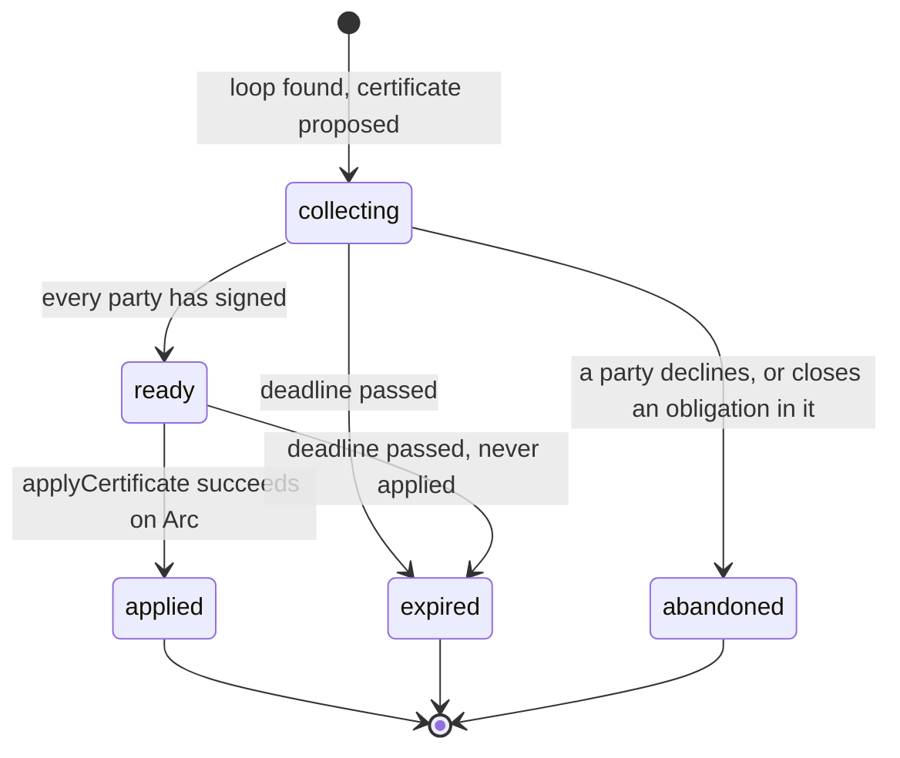

# Offchain netting protocol

This page specifies how offchain obligations are recorded, netted and checked. For a plain-language overview see
[Offchain obligations](../offchain-obligations.md). The contract side is in [Contracts](contracts.md#contraflownettingledger).

The design goal: parties net debts that stay in their own currency and off the chain, while the chain guarantees
that no debt is netted twice, and nobody learns an amount they aren't party to.

## Obligation

An obligation starts as a human-readable **document**, which both parties see:

```json
{
  "amount": "100.00",
  "creditor": "0x71e36e350bc4c3c5eccc193955c456f8b1c6ff75",
  "currency": "USD",
  "debtor": "0x504da6d1cb3cfc170330e2844da610b2850dfa18",
  "description": "Invoice 1042, October media buy",
  "earlyNetConsent": true,
  "format": "contraflow-obligation/1",
  "maturity": "2026-12-31"
}
```

- **Canonical form.** The document is serialised with sorted keys, lowercased addresses and a trimmed
  description. `documentHash = keccak256(utf8(canonical JSON))`. Both parties' browsers compute it, and the
  `format` tag means an obligation document can never hash the same as an invoice document. Copy-paste helper
  and three known hashes: [API reference](api.md#post-obligationsproposals).
- **Signed struct.** The document becomes the EIP-712 `NettingObligation` both parties sign:
  - `amount` in the currency's ISO 4217 minor units (cents for USD, whole yen for JPY);
  - `maturity` at midnight UTC of the date;
  - a random 32-byte `salt`, so two identical documents are still distinct obligations.
- **ID and key.** `obligationId` is the EIP-712 digest of that struct under the ledger's domain. The ledger's
  storage key is `obligationKey = keccak256(abi.encode(obligationId, debtor, creditor))`, which binds the state to
  its two parties.

### Recording



Nothing is written onchain when an obligation is recorded, and it costs no gas. A signature that can't be checked
(for example a smart-account signer the server can't reach) counts as a failure, and nothing is stored.

## State commitments

The ledger stores one 32-byte commitment per obligation:

```
commitment = keccak256(abi.encode(obligationId, remaining, blinding))
```

- **Blinding.** `blinding` is 32 random bytes from the platform's CSPRNG, fresh for every state. Without it anyone
  could recover `remaining` by hashing guesses (round amounts are easy to guess).
- **Never netted.** An obligation that has never been netted has commitment zero, and its remaining amount must
  equal its full amount.

## Netting certificate

When obligations in one currency form a closed loop, Contraflow proposes a certificate:
- **Size:** 2 to 5 parties, each appearing once.
- **Amount:** `wNet` is the smallest remaining amount in the loop.
- **One entry per obligation:**

| Entry field | Value |
|---|---|
| `obligationId`, `debtor`, `creditor` | From the obligation |
| `priorCommitment` | The obligation's current state (zero if never netted) |
| `nextCommitment` | `commitment(obligationId, remaining − wNet, freshBlinding)` |

The certificate itself is `{certificateId (random), contentHash, deadline, entries}`. It's valid for 7 days.

### contentHash

Each party must be able to check the certificate without seeing anyone else's amounts, so `contentHash` is built
from per-entry hashes:

```
entryHash   = keccak256(abi.encode(obligationId, remainingBefore, blindingBefore,
                                   remainingAfter, blindingAfter,
                                   keccak256(debtorSignature), keccak256(creditorSignature)))
contentHash = keccak256(abi.encode(1, keccak256(currency), wNet, entryHash[]))
```

- **What a party holds.** Each party holds its own two entries in full and every other entry only as its
  `entryHash`.
- **What it can check.** That's enough to recompute `contentHash` and check the certificate commits to its own
  obligations exactly, while learning nothing about the other obligations' amounts.

### Lifecycle



- **One open certificate per obligation.** An obligation can be in at most one open (collecting or ready)
  certificate at a time, enforced by a unique index in the database. Closing an obligation abandons a collecting
  certificate, and is refused while a certificate is ready.
- **Signing.** Each party signs the certificate's EIP-712 digest once, as the debtor of its entry, after its
  browser has checked the certificate.
- **Applying.** Anyone can submit the fully signed certificate to the ledger; the sender pays the gas. The ledger's
  checks are listed in [Contracts](contracts.md#applycertificate-checks-in-order).
- **The database follows the ledger.** The server only advances an obligation's stored `remaining` and `blinding`
  once the ledger reports the certificate applied, and the stored state reproduces the onchain commitment. If the
  ledger has moved past what the database knows, the obligation is marked out of sync and excluded from netting,
  never guessed at.

### Why the same debt can't be netted twice

A certificate names each obligation's current state as its `priorCommitment`, and the ledger rejects it with
`StaleCommitment` unless that matches `stateOf(obligationKey)`. Applying a certificate replaces the state. So once
applied, no other certificate built on the old state can be applied, and the certificate ID itself can only be
applied once.

## Certificate file

Each party can export its view as a `contraflow-netting-certificate/1` JSON file:

| Field | Contents |
|---|---|
| `format` | `"contraflow-netting-certificate/1"` |
| `domain` | `chainId`, `verifyingContract` (the ledger) |
| `currency`, `wNet` | The loop's currency and netted amount |
| `certificate` | `certificateId`, `contentHash`, `deadline`, `entries` (as submitted onchain) |
| `signatures` | Every party's certificate signature, in entry order |
| `entries` | Per entry, either `{kind: "full", document}` (the party's own: obligation, both signatures, remaining and blinding before and after) or `{kind: "hash", entryHash}` |

Integers are decimal strings. The file never contains another party's amounts.

## What "Verify a certificate" checks

`/app/verify` runs every check in the browser and never uploads the file:

| Check | Passes when |
|---|---|
| Shape | Every field has the right type and the entry counts line up |
| Chain | The file is for the network the page reads from |
| Loop | 2–5 entries, each creditor is the next entry's debtor, no party twice |
| Party signatures | Each entry's debtor signed the certificate digest (ECDSA with OpenZeppelin's rules, or ERC-1271 checked onchain) |
| Coverage | At least one entry is held in full |
| Per full entry | The obligation hashes to the entry's ID; the parties match; both parties signed the obligation; the currency matches; the prior commitment reproduces; `remainingAfter = remainingBefore − wNet`; the next commitment reproduces; the obligation was mature or both consented to early netting |
| Content hash | Recomputing `contentHash` from the file gives the certificate's value |
| Onchain | The ledger reports the certificate applied, and shows each held obligation's current state |

The result is **"Every check passed"** only if every check passes. A signature that can't be checked is reported
as unverifiable, never as a pass.

## Loop search

- **Graph.** The server builds one graph per currency from obligations that are active, have something remaining,
  and are matured or early-consented. Obligations out of sync with the ledger are excluded.
- **Search.** It searches the neighbourhood of the party asking, for loops of 2–5 parties, all distinct, using the
  same solver as invoice settlement.
- **Result.** The first currency with a loop wins, so repeated searches are deterministic.
