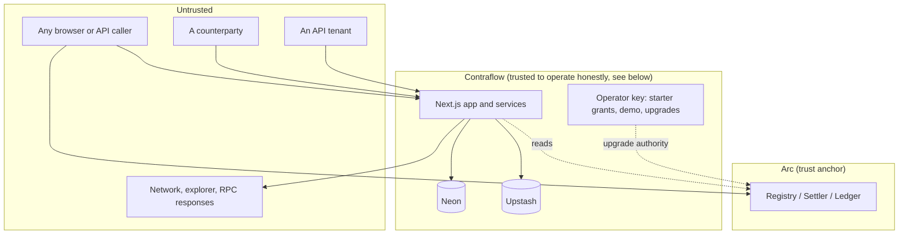

# Security model

This page sets out what Contraflow protects, how, and what you're trusting when you use it. Each control is stated
as the invariant it enforces. For the plain-language version, see
[Trust and security](../how-it-works.md#trust-and-security).

## Threat model

| Actor | Can | Can't |
|---|---|---|
| Anyone | Call `register`, `settle`, `applyCertificate` with valid inputs under the current implementation; use the public pages | Register an invoice or advance an obligation without the parties' signatures under the current implementation |
| A counterparty | Sign, decline or ignore what it's sent | Change the terms the other party signed without the change being detected |
| An API tenant | Act for parties that signed it a permission, within its scopes | Sign for any party; see anything outside its permissions |
| Contraflow | See everything stored in its database, including obligations; propose certificates; upgrade the contracts | Sign for any party; net a debt without every party's signature or net the same obligation twice under the current implementation |

## Onchain controls

| Invariant | How it's enforced |
|---|---|
| An invoice exists only if both parties signed exactly these terms | `register` recovers both EIP-712 signatures and requires each to match its named party. The domain binds the chain and the registry, and the attestation also names both. |
| A signature can't be reused in a malleable form | OpenZeppelin ECDSA rules: 65-byte signatures, low-`s` only, `v` of 27 or 28. |
| Invoices for a pair are registered in order, and none can be skipped | The nonce must be exactly the last one plus one, starting at 1. A race can't burn a signed invoice's nonce. |
| A settlement is a real loop of distinct parties | Path continuity (each creditor is the next debtor), distinct invoice IDs, distinct debtors, 3–5 invoices. |
| A settlement can't take more than is owed or net too early | Per invoice: `Active`, matured or early-consented, `wNet ≤ remaining`. Any failure reverts the whole settlement. |
| An obligation state only moves with every party's signature | One signature per entry from that entry's debtor. In a loop that covers both parties of every obligation. ECDSA is checked first, then ERC-1271 for a signer with code, so EIP-7702 accounts' plain signatures still work. |
| No obligation is netted twice | Each entry's `priorCommitment` must equal the stored state (`StaleCommitment` otherwise), a certificate ID applies once, and states are keyed to the obligation's two parties. |
| Onchain data reveals no amounts | Only blinded commitments are stored: `keccak256(id, remaining, blinding)`, with 32 random bytes of blinding per state. |
| No custody | None of the contracts holds or transfers a token. |

## Invoice and obligation documents

| Invariant | How |
|---|---|
| Both parties sign the same description | The invoice's `invoiceRef` and the obligation's `documentHash` are `keccak256` of a canonical document (sorted keys, lowercased addresses, trimmed text, a format tag). |
| A tampered share link is rejected, not shown with a warning | The counterparty's browser re-hashes the document before checking any signature, and fails closed on a mismatch. |
| The server stores only what verifies | Proposals are re-validated from scratch when accepted, including signatures against the chain. A signature that can't be checked counts as a failure. |

## Access to stored data

| Data | Who can read it |
|---|---|
| Invoice descriptions | The invoice's two parties, through session-checked actions only |
| Obligations and proposals | Their two parties, or a tenant holding a party's `read` permission |
| Certificates | Each party sees its own obligations in full and every other entry as a hash only |
| Onchain invoice cache, stats, inspector | Public, since it's public onchain anyway |

Anyone else gets "Not found", never "Forbidden", so a request can't confirm that a row exists. Short links are
random tokens, but the token is a handle, not the access control: reads always check the signed-in party.

## Sessions and the API

| Control | Detail |
|---|---|
| Sign-in | EIP-4361 messages built and verified server-side with viem. The domain comes from server configuration, never a request header. Nonces are single-use in Upstash. |
| Session | An HMAC-signed cookie holding only the address: HttpOnly, `SameSite=Lax`, `Secure` in production, 24 hours. Signing out also records a hash of the cookie as revoked until it would have expired, so a copy of it stops working. If that record can't be read, the session counts as signed out. |
| API keys | Random 32 bytes. Only a SHA-256 hash is stored, and the key is shown once. The key decides the network. |
| API permissions | EIP-712 grants signed by the party, scoped (read / propose / deliver signatures), expiring within a year, revocable. None allows signing. |
| Idempotency | A reservation row is written before the request runs, so concurrent retries can't both execute. |
| Webhooks | HMAC-SHA256 over timestamp and body, a 5-minute tolerance, redirects refused, and current tenant/read permissions rechecked before each send; revoked access suppresses queued events. |

## Abuse limits

| Surface | Limit |
|---|---|
| Public lookups (inspector, stats, EURC quotes) | Per-IP rate limits, **failing closed** if the limiter is unreachable. A quote takes only an invoice id; the amount comes from the Registry. |
| Obligations and certificates | Per-party read, write and search limits |
| API | Per-tenant budget; fails closed |
| Starter gas grant | Signed-in addresses only, once per address, rate-limited, and capped per day |

## What you're trusting

- **The upgrade key.**
  - The three contracts are upgradeable by a single administrative key held by the team: not a multisig, and not
    a governance vote.
  - An upgrade can change how the contracts behave from then on.
  - The key has no other power, but it's a real point of trust.
- **Contraflow's view of obligations.** Contraflow stores the obligations submitted to it and can read them; it
  needs them to find loops. It can't sign for anyone, and the ledger stops anything being netted twice.
- **What's public.** For invoices, the parties, amounts and terms are public on Arc. For obligations, the
  addresses in each certificate and the loop's shape are public, so participation isn't anonymous.
- **Moving USDC between chains.** Bringing USDC from another chain runs between the user's wallet and Circle
  Gateway, in the browser. Contraflow's server never sees a signature or holds the funds, and the page only ever
  sends USDC to the signed-in address. What you trust there is Circle and your own wallet.
- **Service providers.** Availability depends on Vercel, Neon, Upstash, Privy (sign-in) and the Arc explorer.
  None of them can sign for a party. Neon's invoice tables are a cache the chain can rebuild, but offchain
  obligations and certificates exist only there and in the certificate files parties download, since
  the chain holds only blinded commitments.

## Residual risks

| Risk | Why it's accepted, or how it's bounded |
|---|---|
| The contracts haven't had a formal third-party audit | Source is published and verified; every transaction is public |
| Address screening is a maintained list, not a vendor integration | Stated plainly in the Terms; it isn't AML or sanctions clearance |
| Webhook signing secrets are stored as-is | HMAC signing needs the secret itself. They sit in a table no public path reads. |
| On Vercel's Hobby plan, webhook retries run daily | First deliveries go out straight after each request or action; only retries wait for the cron |
| A settlement or certificate isn't a legal discharge of a debt | It's a signed record used alongside the parties' own agreements (see the Terms) |
